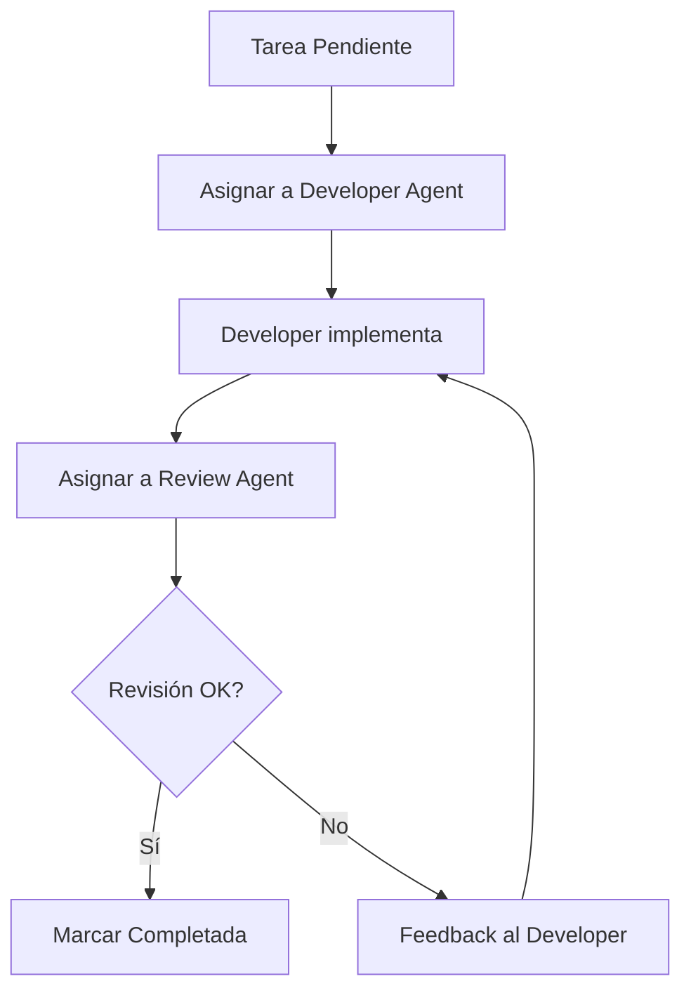

# 🤖 Sistema de Agentes para Gestión de Tareas

Este directorio contiene la configuración y prompts para los agentes especializados en el desarrollo y revisión de tareas.

## Agentes Disponibles

### 🛠️ TypeScript Developer Agent
- **Especialización**: Desarrollo en TypeScript/React Native
- **Responsabilidades**:
  - Implementar mejoras y nuevas funcionalidades
  - Refactoring de código existente
  - Optimización de performance
  - Integración con Firebase y Zustand
  - Mantener patrones arquitecturales

### 🔍 Code Review Agent
- **Especialización**: Revisión y validación de código
- **Responsabilidades**:
  - Análisis de calidad de código
  - Verificación de buenas prácticas
  - Testing de funcionalidad
  - Validación de tipos TypeScript
  - Asegurar consistencia arquitectural

## Flujo de Trabajo



## Uso del Sistema

### 1. Inicializar el sistema
```bash
node scripts/task-automation.js init
```

### 2. Asignar tarea a desarrollador
```bash
node scripts/task-automation.js assign 1 developer
```
Esto genera un prompt detallado en `task-1-dev-prompt.md`

### 3. Enviar a revisión
```bash
node scripts/task-automation.js review 1 reviewer
```
Esto genera un checklist de revisión en `task-1-review-prompt.md`

### 4. Completar tarea
```bash
node scripts/task-automation.js complete 1
```

### 5. Ver estado actual
```bash
node scripts/task-automation.js status
```

### 6. Obtener próxima tarea
```bash
node scripts/task-automation.js next
```

## Archivos Generados

- `developer-config.json` - Configuración del agente desarrollador
- `reviewer-config.json` - Configuración del agente revisor
- `task-N-dev-prompt.md` - Prompt específico para implementación
- `task-N-review-prompt.md` - Checklist específico para revisión

## Prompts Personalizados

Los prompts se generan automáticamente con:
- Descripción detallada de la tarea
- Archivos específicos a modificar
- Criterios de aceptación
- Comandos para completar
- Contexto del proyecto

## Integración con Claude Code

Cada prompt está diseñado para ser usado directamente con Claude Code, incluyendo:
- Instrucciones específicas en español
- Comandos de finalización
- Referencias a archivos del proyecto
- Checklist de validación